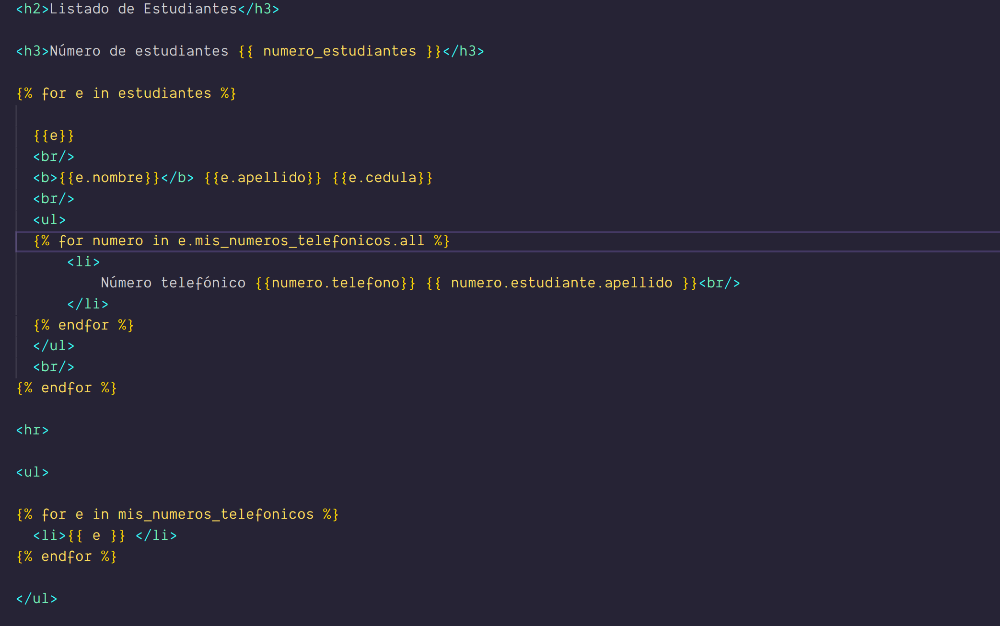

# clase03-2bim

# imagen Explicacion

la expresion e.numerotelefonico_set.all el _set hace referencia si no encuentra una relacion en la entidad 
simplemente si no existe la relacion pasa de largo y no genera error.
